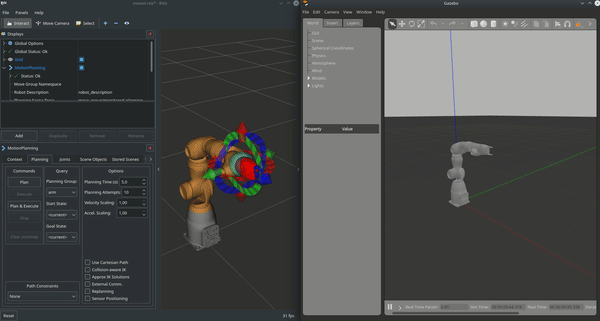
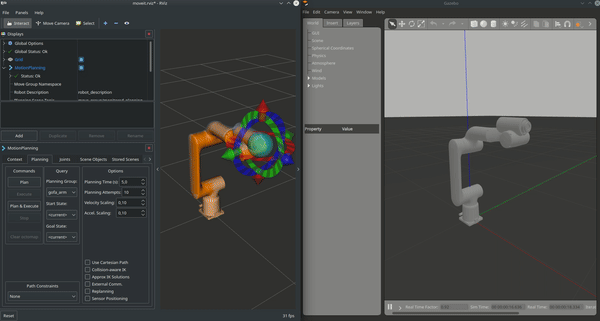
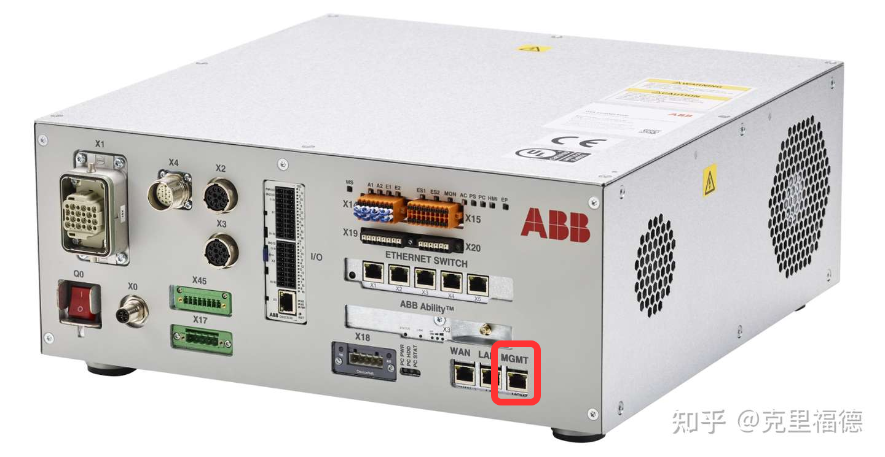

# Wrapper ros_control for ABB Omnicore Controller
These packages are intended to ease the interaction between ABB robots supporting the new Omnicore controller and ROS-based systems, by providing ready-to-run ROS nodes. In particular, we developed the robots' control with [ros_control](https://wiki.ros.org/ros_control) integrating it with [MoveIt](https://moveit.picknik.ai/main/index.html).
The supported [Omnicore controller](https://new.abb.com/products/robotics/controllers/omnicore) based robots are: 
- CRB 15000-5 - Gofa
- IRB 14050 - Yumi Single Arm.

## Hardware Dependencies

**OS**: Ubuntu 20.04 
**ROS**: Noetic

Tested on Ubuntu 20.04 with ROS Noetic. Support on older ROS distro (melodic see: [#18](/../../issues/18)) is expected but not tested.

## Overview

These packages are intended to ease the interaction between ABB OmniCore controllers and ROS-based systems, by providing ready-to-run ROS nodes.

The principal packages are briefly described in the following table:

| Package | Description |
| --- | --- |
| [abb_libegm](abb_libegm) | (A modified version of https://github.com/ros-industrial/abb_libegm) Provides a ROS node that exposes hardware interface, for *direct motion control* of ABB robots (via the *Externally Guided Motion* (`EGM`) interface). |
| [abb_librws](abb_librws) | (A modified version of https://github.com/ros-industrial/abb_librws) Provides a ROS node that communicate with the controller using Robot Web Services 2.0  |
| [Doc](Doc) | Provides some documentation about how the RAPID StateMachine running inside the Omnicore Controller  |
| [gazebo_omnicore](gazebo_omnicore) | Provides the possibility to simulate the robots in Gazebo  |
| [moveit_config](moveit) | Provides the Moveit configurations for the supported robots. |
| [omnicore_interface](omnicore_interface) | Provides all messages and services definition this pkg uses. |
| [omnicore_launcher](omnicore_launcher) | Provides all the .launch files to correctly launch the robots in real or simulation. |
| [robots_description](gofa_description) | Provides ROS nodes for kinematic calculation using the URDF model of the robot (For now only Gofa robot is available). |
| [ros_control_omnicore](ros_control_omnicore) | Provides hardware interface for the robots supporting ABB Omnicore controller. |

## Build Instructions

It is assumed that [ROS Noetic has been installed](https://wiki.ros.org/noetic/Installation/Ubuntu) on the system in question.

#### Set up ROS

The following instructions assume that a [Catkin workspace](http://wiki.ros.org/catkin/Tutorials/create_a_workspace) has been created at `$HOME/catkin_ws` and that the *source space* is at `$HOME/catkin_ws/src`. Update paths appropriately if they are different on the build machine.

The following instructions should setup a ROS workspace where you will clone the current repository.

```bash

mkdir -p ~/catkin_ws/src
cd ~/catkin_ws/
catkin build
```

#### Install Moveit! and ros_control

```bash
sudo apt install ros-${ROS_DISTRO}-ros-control ros-${ROS_DISTRO}-ros-controllers
sudo apt install ros-${ROS_DISTRO}-moveit
```

#### Install POCO

Install essential dependencies and git, execute the following commands one by one:

```bash
sudo apt update
sudo apt upgrade
sudo apt install build-essential gdb cmake git
sudo apt-get install openssl libssl-dev
sudo apt-get install libmysqlclient-dev
```

Get root access:
```bash
sudo -i
```

Navigate to /tmp/ directory (or any other directory to store temporary files).
```bash
cd /tmp/
```

Clone the Poco git repo:
```bash
git clone https://github.com/pocoproject/poco.git
```

Compile the libraries:
```bash
cd poco
mkdir cmake-build
cd cmake-build
cmake ..
cmake --build . --config Release
```

Install the libraries to include in C++ code:
```bash
sudo cmake --build . --target install
```

Copy or move all the poco file from /usr/local/lib/ to /usr/lib using the root privileges. Afterward you may remove the created /tmp directory:

```bash
sudo cp /usr/local/lib/*Poco* /usr/lib
```

#### Install Boost C++

[Boost C++](https://www.boost.org)
```bash
sudo apt-get install libboost-all-dev
```

#### Clone the repo

Clone the current repository in the newly created ROS workspace 'catkin_ws' and build it:
```bash
cd catkin_ws/src
git clone https://github.com/MerlinLaboratory/ABB_omnicore_ros_driver.git
cd ..
catkin build
```

If there are no errors and you want to setup the real robot download [RobotStudio](https://new.abb.com/products/robotics/robotstudio/downloads) and go to the [appropriate chapter](#robotstudio) to setup the real robot. Conversely, you can start to use the robots in simulation following [this chapter](#simulation).

## Simulation

It is possible to launch both the gofa and yumi single arm in Gazebo with the following commands: 

```bash
  roslaunch gazebo_omnicore yumi_single_arm.launch # To launch Yumi Single Arm
  roslaunch gazebo_omnicore gofa.launch # To launch Gofa
```

| Yumi Single Arm | Gofa |
|:---:|:---:|
|  |  |

## RobotStudio

### Requirements

* RobotWare version `7.2` or higher (lower versions are incompatible due to changes in the EGM communication protocol).
* A license for the RobotWare option *Externally Guided Motion* (`3124-1`).
* StateMachine 2.0 RobotWare Add-In (present on the RobotApps of RobotStudio)


### Connect to MGMT port
Connect your robot controller to you network through the MGMT port:



The MGMT port have a fixed IP address (*192.168.125.1*) and a DHCP server. Despite the DHCP server, as you will see in the next steps,you will need to specify a static ip for your computer.

### Setup the UDP server

In this step we will configure the IP address that EGM exploits to commununicate with an external device. In particular, we need to specify the ip and port of an UDP server that will run on your computer and EGM connects to. Therefore, the ip we are going to specify **must be the same of the PC running ROS.**

Open RobotStudio go under the Controller Tab, click Add Controller > One Click Connect and log in as default user: 


Using RobotStudio, first **request the write access**.

  

On the Controller tab, in the Configuration group, click Configuration and then click `Communication`.

  

Double click on the `UDP Unicast Device` item.

  

Set **ROB 1 IP = 192.168.125.100**
Set **UCDEVICE IP = 192.168.125.100**

**Set 192.168.125.100 as static ip of the Linux machine running ROS**.

### Setup the Controller Firewall
Using RobotStudio, first **request the write access**.
On the Controller tab, in the Configuration group, click Configuration and then click `Communication`.

Double click on the `Firewall Manager` item.
Enable on the public network the following services:
* RobotWebServices
* UDPUC (available from RW 7.3.2)

  

### Configure the user privileges
This package use the [Robot Web Services 2.0](https://developercenter.robotstudio.com/api/RWS) (RWS) to control the robot.
Each RWS session is logged using a user that must to be present on the User Authorization System of the controller (for more details about User Authorization System, see Operating manual - RobotStudio).
If not specified, for the RWS communication, the default user is used:
* Username: **Default User**
* Password: **robotics**

By default, the **Default User** does not have the grant *Remote Start and Stop in Auto* (run rapid routine from the WAN port in Auto mode).

The steps to configure the user account are:
1. Using RobotStudio log-in on the controller as Administrator (usually with the user **Admin** and password **robotics**).
  
  

2. On the Controller tab, in the Access group, click Authenticate and then click `Edit User Account`.
   

3. On the tab roles check if the grant *Remote Start and Stop in Auto* is checked for the role of the Default User.

   

4. Apply.

Any other user can be used by passing the name and the password to **rws_interface**.

 
## Set up Config File and launch your abb robot (e.g. Gofa) 
Navigate to ros_control_omnicore/config/XXX_cfg.yaml
Modify the parameters based on your robot configuration (e.g. ip_robot, name_robot, task_robot, etc.). Note that the robot IP in the yaml has to be the the one of the MGMT port of the robot controller (**default is 192.168.125.1**)
Finally:

- Make sure that the application StateMachine 2.0 has loaded in robotstudio in rapid codes from the controller folder "EGM" 
- Set robot in Automatic and Motors ON
- Connect an ethernet cable from your Linux machine to the controller MGMT port
- Set the Linux machine IP address to 192.168.125.100 (it needs to be the same as the one in "Setup the UDP device")

By default, the repo launches the **Gofa** robot with a **velocity_controller/JointTrajectoryController**:
```bash
  source devel/setup.bash
  roslaunch omnicore_launcher real_robot.launch
```
The pkg has been tested with the following ros_control controllers:
- velocity_controller/JointTrajectoryController
- position_controller/JointTrajectoryController
- joinGroupVelocityController
- joint_state_controller (launched by default by the pkg)

It is possible to switch from one controller to the other using [ros_control nodes](https://answers.ros.org/question/259022/switching-between-controllers-with-ros_control-controller_manager/). 
**Note:** velocity_controller and position_controller are mutually exclusive and cannot be used together. See [configuration file](ros_control_omnicore/config) for each robot to decide with controller to load and which controller to start 

Furthermore, it is possible to set the robot in free drive without the necessity to stop the node:

- Switch to FreeDrive control when ROS is running:
    ```bash
    rosservice call /set_control_to_free_drive
    ```
- Switch back to velocity control (EGM):
    ```bash
    rosservice call /set_control_to_egm
    ```

# Troubleshooting

If the previous command's output is **"EGM IS NOT CONNECTED"**, Linux's firewall blocks UDP communications with the robot controller. Therefore, you will need to allow the communication in INPUT and OUTPUT to your Linux machine with these two commands:

```bash
  sudo iptables -I INPUT -p udp --dport 6511 -j ACCEPT
  sudo iptables -A OUTPUT -p udp -m udp --sport 6511 -j ACCEPT
```