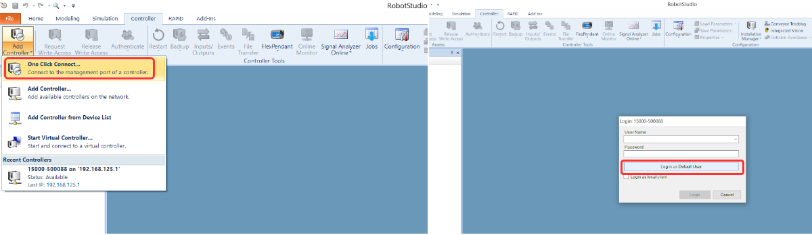

# abb_wrapper
These packages are intended to ease the interaction between ABB robots supporting the new Omnicore controller and ROS-based systems, by providing ready-to-run ROS nodes. In particular, we developed the robots' control with ros_control. Furthermore, we integrated moveit! for the supported robots so that you can sends trajectories directly to ros_control and then to the real controller.
The supported robots are: Gofa and Yumi Single Arm (together with the SmartGripper).

## Important Notes
Tested on Ubuntu 20.04 with ROS Noetic. Support on other ROS distro is expected but not tested.

## Overview

These packages are intended to ease the interaction between ABB OmniCore controllers and ROS-based systems, by providing ready-to-run ROS nodes.

The principal packages are briefly described in the following table:

| Package | Description |
| --- | --- |
| [abb_libegm](abb_libegm) | (A modified version of https://github.com/ros-industrial/abb_libegm) Provides a ROS node that exposes hardware interface, for *direct motion control* of ABB robots (via the *Externally Guided Motion* (`EGM`) interface). |
| [abb_librws](abb_librws) | (A modified version of https://github.com/ros-industrial/abb_librws) Provides a ROS node that communicate with the controller using Robot Web Services 2.0  |
| [moveit_config](moveit) | Provides the Moveit configurations for the supported robots. |
| [omnicore_launcher](ros_control) | Provides all the .launch files to correctly launch the robots in real or simulation. |
| [robots_description](gofa_description) | Provides ROS nodes for kinematic calculation using the URDF model of the robot (For now only Gofa robot is available). |
| [ros_control_ominicore](ros_control) | Provides hardware interface for the robots supporting ABB Omnicore controller. |
| [rws_service](rws) | Provides some services for the yumi_single_arm SmartGripper. |
| [abb_wrapper_msgs](abb_wrapper_msgs) | Provides srvs definition for ros services used in abb_wrapper_control. |
| [abb_wrapper_control](abb_wrapper_control) | Provides ros services for planning (PosePlan, SlerpPlan and JointPlan) and ros actions for controlling the robot(ArmService and ArmWait). |

Please see each package for more details (*e.g. additional requirements, limitations and troubleshooting*).

## Build Instructions

It is assumed that [ROS Noetic has been installed](https://wiki.ros.org/noetic/Installation/Ubuntu) on the system in question.

### Set up ROS

The following instructions assume that a [Catkin workspace](http://wiki.ros.org/catkin/Tutorials/create_a_workspace) has been created at `$HOME/catkin_ws` and that the *source space* is at `$HOME/catkin_ws/src`. Update paths appropriately if they are different on the build machine.

The following instructions should build the main branches of all required repositories on a ROS Noetic system:

```bash
echo "source /opt/ros/noetic/setup.bash" >> ~/.bashrc

mkdir -p ~/catkin_ws/src
cd ~/catkin_ws/
catkin_make

```

If no errors were reported as part of the `catkin_make` command, the build has succeeded and the driver should now be usable.

### Install Moveit! and ros_control

```bash
sudo apt install ros-noetic-ros-control ros-noetic-ros-controllers
sudo apt install ros-noetic-moveit
```

### Install POCO

Install essential dependencies and git, execute the following commands one by one:

```bash
sudo apt update
sudo apt upgrade
sudo apt install build-essential gdb cmake git
sudo apt-get install openssl libssl-dev
sudo apt-get install libmysqlclient-dev
```

Get root access:
```bash
sudo -i
```

Navigate to /tmp/ directory (or any other directory to store temporary files).
```bash
cd /tmp/
```

Clone the Poco git repo:
```bash
git clone -b master https://github.com/pocoproject/poco.git
```

Compile the libraries:
```bash
cd poco
mkdir cmake-build
cd cmake-build
cmake ..
cmake --build . --config Release
```

**Note**: If you get a library not found error, just install that library via apt.

Install the libraries to include in C++ code:
```bash
sudo cmake --build . --target install
```

Copy all the poco file from /usr/local/lib/ to /usr/lib

### Install Boost C++

[Boost C++](https://www.boost.org)
```bash
sudo apt-get install libboost-all-dev

```

### Set up the interface

Copy **abb_wrapper** folder to **src** folder on catkin workspace (`~/catkin_ws/src`).
```bash
cd catkin_ws/src
git clone -b DRIM-Volterra https://github.com/MerlinLaboratory/abb_wrapper.git
```

Move back to the workspace folder (catkin_ws/)
```bash
cd ..
```

Compile the workspace
```bash
catkin_make
```
## Gazebo Simulation
If there are no errors you are ready to proceed to launch the Gazebo simulation of the robot:
```bash
  source devel/setup.bash
  roslaunch irim_ss_pkg yumi_gazebo.launch
```
### Motion Planning
Launch the PosePlan, SlerpPlan and JointPlan ROS Services server:
```bash
  source devel/setup.bash
  roslaunch abb_wrapper_control launchControlServer.launch
```
To test the if everything works you can launch the example script with:
```bash
  source devel/setup.bash
  roslaunch abb_wrapper_control launchTaskServerExample.launch
```
This launcher runs the script "task_server_example.cpp".

ATTENTION: remember to press 'next' in the RvizVisualToolsGui window to execute the motion on the robot.

There is a third launcher:
```bash
  source devel/setup.bash
  roslaunch abb_wrapper_control launchTaskServerTemplate.launch
```
that runs the blank template "task_server_template.cpp" that you can use to write your own code for the hands on.

If there are no errors you are ready to proceed to set up the robot.

## Robot Set up

### Requirements

* RobotWare version `7.2` or higher (lower versions are incompatible due to changes in the EGM communication protocol).
* A license for the RobotWare option *Externally Guided Motion* (`3124-1`).
* StateMachine 2.0 RobotWare Add-In (present on the RobotApps of RobotStudio)


After the creation of the system just configure robot to accept external communication both for EGM and Web Services (see next steps).
### RobotStudio

Open RobotStudio


On the Controller Tab, click Add Controller > One Click Connect..



Click on "Log in as Default User" button


### Setup the IP address for the WAN port
With this configuration, we will set up the IP address of the WAN port where the computer running ROS will be connected.

* On the Controller tab, in the Configuration group, click Properties and then click `Network settings`.
  The Network settings dialog opens.
  
  

* Select `Use the following IP address` and then enter the required IP address and Subnet mask boxes to manually set the IP address of the controller


  

**POLIMI SETUP: 
set WAN IP = 192.168.131.200**

**This step is optional, also the MGMT port can be used.**

The MGMT port have a fixed IP address (*192.168.125.1* ) and a DHCP server.

If you are using the MGMT port make sure that the connected computer running ROS is on the same network (*192.168.125.xx* ) or the DHCP is enabled.

### Setup the UDP device
Configure the IP address and the port to use for the UDP protocol. **This IP address must be the same of the PC running ROS.**

Using RobotStudio, first **request the write access**.

  

On the Controller tab, in the Configuration group, click Configuration and then click `Communication`.

  

Double click on the `UDP Unicast Device` item.

  

**POLIMI SETUP:**

**set ROB 1 IP = 192.168.131.5**

**set UCDEVICE IP = 192.168.131.5**
The ip address `192.168.131.5` is the ip of the Linux machine running ROS. Set the ip address of the Linux machine as static and to the address `192.168.131.5`.

### Setup the Controller Firewall
Using the WAN port the firewall on the public network must be configured.

Using RobotStudio, first **request the write access**.
On the Controller tab, in the Configuration group, click Configuration and then click `Communication`.

Double click on the `Firewall Manager` item.
Enable on the public network the following services:
* RobotWebServices
* UDPUC (available from RW 7.3.2)

  

### Configure the user privileges
This package use the [Robot Web Services 2.0](https://developercenter.robotstudio.com/api/RWS) (RWS) to control the robot.
Each RWS session is logged using a user that must to be present on the User Authorization System of the controller (for more details about User Authorization System, see Operating manual - RobotStudio).
If not specified, for the RWS communication, the default user is used:
* Username: **Default User**
* Password: **robotics**

By default, the **Default User** does not have the grant *Remote Start and Stop in Auto* (run rapid routine from the WAN port in Auto mode).

The steps to configure the user account are:
1. Using RobotStudio log-in on the controller as Administrator (usually with the user **Admin** and password **robotics**).
  
  

2. On the Controller tab, in the Access group, click Authenticate and then click `Edit User Account`.
   

3. On the tab roles check if the grant *Remote Start and Stop in Auto* is checked for the role of the Default User.

   

4. Apply.

Any other user can be used by passing the name and the password to **rws_interface**.

 
## Set up Config File and launch your abb robot (e.g. Gofa) 
Navigate to ros_control_gofa/config/gofa_cfg.yaml
Modify the parameters based on your robot configuration (e.g. ip_robot, name_robot,task_robot, etc.). Note that the IP robot in the yaml has to be the same of the WAN port of the robot controller (**POLIMI Setup = 192.168.131.200**)

Finally 

- Make sure that the application StateMachine 2.0 has loaded in robotstudio in rapid codes from the controller folder "EGM" 
- Set robot in Automatic and Motors ON
- Connect an ethernet cable from your Linux machine to the controller WAN port
- Set the Linux machine IP address to 192.168.131.5 (it needs to be the same as the one in "Setup the UDP device")

By default, the repo launches the **Gofa** robot with a **position_controllers/JointTrajectoryController**:
```bash
  source devel/setup.bash
  roslaunch omnicore_launcher real_robot.launch
```

# Final notes
Before you try to use the robot purely in simulation with RobotStudio + ROS, let me save you valuable time: **it does not work**. Or at least, it works if you want to control the robot with RWS only and not with EGM (note that if you want to move the robot without a RAPID script, you will need EGM pkg).

The fun thing is that it does not work not because of a software problem from ROS or this package but because ABB, at least when you want to virtualise the controller with RobotStudio, does not allow any communication with external computers except the one where RobotStudio is running. RobotStudio can only run on Windows, so it is possible (as far as I know) to have the two running on the same machine. If you solve this issue somehow, email me at niccolo.lucci@polimi.it or make a pull request.  
